# Testing a C# Application Using xUnit

The purpose of this project is testing a C# application using one of the available tools, in order to get familiar with the basic testing concepts, such as unit testing, mutation testing and more. In order to get started, a unit testing tool needs to be decided upon. Since there are multiple tools to choose from, the three best options available are the following: xUnit, NUnit and MSTest. A better understanding of each of them is required before deciding on the one that shall be used further in our project.

## Testing environment

By consulting [medium.com](https://medium.com/@robertdennyson/xunit-vs-nunit-vs-mstest-choosing-the-right-testing-framework-for-net-applications-b6b9b750bec6), these tables come across as relevant.

### Framework Comparison

| Framework  | Description                                                                                                                                                                                |
| ---------- | ------------------------------------------------------------------------------------------------------------------------------------------------------------------------------------------ |
| **xUnit**  | A modern unit testing framework for .NET applications, designed with extensibility, dependency injection, and best practices in mind. It's the default choice for many .NET Core projects. |
| **NUnit**  | One of the oldest and most widely-used unit testing frameworks in the .NET ecosystem, known for its extensive attributes and compatibility with a wide range of tools.                     |
| **MSTest** | Microsoft’s built-in testing framework, well-integrated with Visual Studio. It is often the default for legacy .NET projects and provides solid integration with Microsoft tools.          |

### Comparison of Key Features

| Feature                     | xUnit                    | NUnit                    | MSTest                  |
| --------------------------- | ------------------------ | ------------------------ | ----------------------- |
| **Ease of Setup**           | High                     | High                     | Moderate                |
| **Attributes**              | Minimal                  | Rich set                 | Limited                 |
| **Parallel Test Execution** | Built-in                 | Built-in                 | Limited                 |
| **Dependency Injection**    | Best support             | Moderate                 | Limited                 |
| **IDE Integration**         | Full support in VS/Rider | Full support in VS/Rider | Best with Visual Studio |
| **Mock Framework Support**  | Full                     | Full                     | Full                    |
| **BDD Support**             | Compatible               | Compatible               | Limited                 |

xUnit is a newer technology, being the new standard when it comes to application testing, easily integrable in Visual Studio. It seems to be useful for cross-platform projects and for those including dependency injection. NUnit seems to be appropriate for large, extendable projects, since it provides a wide range of test attributes. MSTest appears to be the legacy model used in .NET testing, being mostly used in older applications, often being integrated into Visual Studio.

For the purpose of this project, we will integrate xUnit into Visual Studio in order to get familiar with testing, as well as being able to keep in touch with the continuously evolving standards. We chose xUnit since it is modern, easy to use, works well with today’s .NET tools, and makes writing and running tests simple, especially when using features like dependency injection and cross-platform support.

Other websites that were used for our documentation are the following:

- https://learn.microsoft.com/en-us/dotnet/core/testing/unit-testing-csharp-with-xunit
- https://learn.microsoft.com/en-us/dotnet/core/testing/
- https://xunit.net/
- https://www.browserstack.com/guide/nunit-vs-xunit-vs-mstest
- https://www.headspin.io/blog/nunit-vs-xunit-vs-mstest
- https://medium.com/@robertdennyson/xunit-vs-nunit-vs-mstest-choosing-the-right-testing-framework-for-net-applications-b6b9b750bec6
- https://daily.dev/blog/nunit-vs-xunit-vs-mstest-net-unit-testing-framework-comparison

## Program description

### DER encoding of ASN.1 structure

ASN.1 (Abstract Syntax Notation One) defines abstract data types and is used in defining data structure in standards such as X509 public key certificates which is widely used (for examle for the TLS implementation in HTTPS) ([RFC2459](https://www.ietf.org/rfc/rfc2459.txt)).

DER (Distinguished Encoding Rules) is specifies rules for encoding and decoding ASN.1 data into / from byte representation.

In DER, each element has a Tag-Length-Value structure:

- Tag (1 byte)
  - bits 8-7: class (universal, application, context-specific, private)
  - bit 6: primitive (0) or constructed (1)
  - bits 5-1: tag number
- Length (>= 1 byte): Number of bytes for the Value part
  - short form (bit 8 is 0)
    - bits 7 - 1 represent the length
  - long form (bit 8 is 1)
    - bits 7 - 1 represent the number of bytes for the length (n)
    - next n bytes represent the length as an unsigned big-endian integer
- Value: Encoded content (interptreted based on tag number)

### Tested method

For testing in this project, we have chosen `GetDataLength` function which decodes the length part from the TLV structure of a DER encoding.

It also handles errors, throwing an exception if an indefinite length is encountered, since DER forbids it.

Furthermore, it also covers the case when there isn't enough data left in the buffer to read the declared length bytes.

```csharp
public int GetDataLength(ReadOnlySpan<byte> buffer, ref int position)
{
    byte firstByte = ReadByte(buffer, ref position);

    // Check if single byte length
    if ((firstByte & 0x80) == 0)
    {
        return firstByte;
    }

    // Get the number of bytes that compose the length
    int numBytes = firstByte & 0x7F;
    if (numBytes == 0)
    {
        throw new Exception("Indefinite length not supported in DER.");
    }

    // Add each byte to the length
    int length = 0;
    for (int i = 0; i < numBytes; i++)
    {
        length = (length << 8) | ReadByte(buffer, ref position);
    }
    return length;
}

```

## Functional testing

### Writing equivalence classes

First of all, we shall understand the use and need of equivalence classes. In testing, equivalence classes represent partitioning the inputs into groups also known as classes, where we assume the method would have a similar behaviour for every input group. For the purpose of this project, we will consider the GetDataLength() method and we will write the equivalence classes for it.

#### 1. **The first bit**

The most important bit can either be 0 or 1. In the first case, the next 7 bits encode the result, in the second, the next 7 bits encode the length of the result. Therefore, two classes stand out.

**BYTE1BIT1:**

- BYTE1BIT1_1: 0
- BYTE1BIT1_2: 1

#### 2. **The next 7 bits**

The next 7 bits can take values between 0 and 127, however, in case of the first bit being 1, the next 7 bits cannot be encoding 0. The two classes are 0 and [1,127].

**BYTE1BIT2-8:**

- BYTE1BIT2-8_1: 0
- BYTE1BIT2-8_2: [1-127]

#### 3.**The following bytes**

Next, if the first bit is not 0, the algorithm will read an number of bytes equal to the value encoded in the bits 2-8. However, there might be less bytes to be read than the number given in the 2-8 bits. Two classes emerge.

**BYTES:**

- BYTES_1 < declared
- BYTES_2 >= declared

This table explains what each value or interval of the encoding bytes implies about the length.

| Case    | BYTE1BIT1 | BYTE1BIT2-8 Value | Number of bytes vs Declared Length | Class Combination                   | Interpretation                                |
| ------- | --------- | ----------------- | ---------------------------------- | ----------------------------------- | --------------------------------------------- |
| C_1_1   | 0         | 0                 | \_\_\_                             | BYTE1BIT1_1, BYTE1BIT2-8_1          | Encodes result = 0, no further processing     |
| C_1_2   | 0         | 1–127             | \_\_\_                             | BYTE1BIT1_1, BYTE1BIT2-8_2          | Result encoded in 7 bits, no extra processing |
| C_2_1   | 1         | 0                 | \_\_\_                             | BYTE1BIT1_2, BYTE1BIT2-8_1          | Not allowed                                   |
| C_2_2_1 | 1         | 1–127             | < declared                         | BYTE1BIT1_2, BYTE1BIT2-8_2, BYTES_1 | Declared length too small for actual data     |
| C_2_2_2 | 1         | 1–127             | >= declared                        | BYTE1BIT1_2, BYTE1BIT2-8_2, BYTES_2 | Valid length                                  |

Choosing random values, we test:
| Case | BYTE1BIT1 (bit 1) | BYTE1BIT2-8 (bits 2–8) | BYTES (beginning with byte2)  
|----------|-------------------|------------------------|-------------------------------|
| C_1_1 | 0 | 0000000 (0) | --- |
| C_1_2 | 0 | 0010110 (22) | --- |
| C_2_1 | 1 | 0000000 (0) | --- |  
| C_2_2_1 | 1 | 0000110 (6) | 0xFF 0x00 |
| C_2_2_2 | 1 | 0000011 (3) | 0xA1 0xB2 0xC3 |

### Boundary Value Analysis

Boundary Value Analysis is typically used together with equivalence partitioning.  
It focuses on examining the boundary values of each class, which are often a common source of errors.

In our example, once the equivalence classes have been identified, the boundary values are easy to determine.

**First bit:**

- BYTE1BIT1_0 = 0
- BYTE1BIT1_1 = 1

**Next 7 bits:**

- BYTE1BIT2-8_1 = 0
- BYTE1BIT2-8_2 = 1
- BYTE1BIT2-8_3 = 127

(is impossible to write 128 in 7 bits)

**Next bytes:**

- BYTES_1: no extra bytes
- BYTES_2: 1 byte
- BYTES_3: 127 bytes
- BYTES_4 128 bytes.

For the next bytes, for the no extra bytes, the value will be BYTES_1 = N/A, and for the others, we randomly choose 1 byte:
BYTES_2 = 0xF0, 127 bytes: BYTES_3 = 0xA0 for 127 bytes BYTES_4 = 0xA0 for 128 bytes.

| Case    | BYTE1BIT1 | BYTE1BIT2-8 | Payload Bytes | Expected Behavior                              |
| ------- | --------- | ----------- | ------------- | ---------------------------------------------- | --- |
| C_1_1   | 0         | 0           | ---           | Valid – Result = 0, the rest ignored           |     |
| C_1_2   | 0         | 1           | ---           | Valid – Result = 1, the rest ignored           |
| C_1_3   | 0         | 127         | ---           | Valid – Result = 127, the rest ignored         |
| C_2_1   | 1         | 0           | ---           | Invalid – Length = 0 not allowed               |
| C_2_2_1 | 1         | 1           | N/A           | Invalid – 1 byte expected, got none            |
| C_2_2_2 | 1         | 1           | F0            | Valid – Result = 240(0xF0) exact match         |
| C_2_2_3 | 1         | 1           | A0 x 127      | Valid – Result = 160(0xA0) extra bytes allowed |
| C_2_2_4 | 1         | 1           | A0 x 128      | Valid – Result = 160(0xA0) extra bytes allowed |
| C_2_3_1 | 1         | 127         | N/A           | Invalid – 127 bytes expected, got none         |
| C_2_3_2 | 1         | 127         | F0            | Invalid – only 1 byte, 126 missing             |
| C_2_3_3 | 1         | 127         | A0 x 127      | Valid – Result = 0xA0 x 127 exact match        |
| C_2_3_4 | 1         | 127         | A0 x 128      | Valid – Result = 0xA0 x 127 extra byte allowed |

## Structural testing

### Coverage testing

**Transforming the code into an oriented graph**

<div style="text-align:center">
    
</div>

**Structural Explanation**

- **Statement coverage**  
  Every line in `GetDataLength` is executed by at least one test.

- **Branch coverage**  
  For `if ((firstByte & 0x80) == 0)` and for `if (numBytes == 0)` we have covered both the “true” and “false” branches.

- **Condition & Decision coverage**  
  Each individual bitwise condition (`firstByte & 0x80`, `firstByte & 0x7F`) takes both `true` and `false` values, and each overall decision also evaluates to both outcomes.

- **Multiple condition coverage**  
  We test all combinations of MSB set/unset and `numBytes` values (0, 1, >1).

- **MC/DC Coverage**  
  The four required scenarios are covered by:

  - `GetDataLength_SingleByte`: `MSB=0`.
  - `GetDataLength_ZeroNumBytes`: `MSB=1 + numBytes=0`.
  - `GetDataLength_MultiByte` (with `numBytes=1`): `MSB=1 + numBytes=1`.
  - `GetDataLength_MultiByte` (with `numBytes=2`): `MSB=1 + numBytes>1`.

- **Circuit and Path Coverage**  
  All 4 linearly independent paths (cyclomatic complexity = 4) are tested, including single-byte, exception, and multi-byte cases.

- **Coverage report**
  We integrated Coverlet into our xUnit test project to collect detailed code‐coverage metrics on every test run. By running

```bash
dotnet test --collect:"XPlat Code Coverage" --results-directory ./TestResults
reportgenerator -reports:TestResults/**/*.cobertura.xml -targetdir:reports -reporttypes:Html
```

we produced a full HTML report in the reports folder. Our latest results show 92 % line coverage and 100 % branch coverage, giving us confidence that nearly all code paths are exercised by our tests.

### Mutation Testing

To further ensure the reliability of our tests, we applied mutation testing using Stryker.NET. This approach evaluates how well the current test suite detects bugs by introducing small code changes (called mutants) and observing whether the tests catch them.

**What is Mutation Testing?**

Mutation testing works by automatically modifying the code—changing operators, logic, or constants—to simulate common mistakes. If the tests fail in response to a mutation, the mutant is killed. If the tests pass, the mutant survives, revealing potential blind spots in our testing strategy.

This method complements traditional code coverage by checking test effectiveness, not just code execution.

**Results Summary**

| Metric               | Value | Explanation                                                                |
| -------------------- | ----- | -------------------------------------------------------------------------- |
| **Mutants Killed**   | 17    | Our test suite successfully detected these faulty code mutations           |
| **Mutants Survived** | 7     | These indicate areas where our tests did not detect injected logic changes |
| **Timeouts**         | 0     | All tests completed execution reliably                                     |

**Interpretation**
The 7 surviving mutants suggest:

- Some edge cases or paths might not be covered adequately.

- Certain assertions may be too weak or missing.

- Potential improvements in test logic or input variety.

- These surviving cases are valuable signals, not failures—they guide us in strengthening our test coverage.

**Next Steps:**

- Review the mutation testing report (StrykerOutput/reports/mutation-report.html).

- Identify why each surviving mutant was not detected.

- Add or improve tests to cover these blind spots.

- Re-run mutation testing to confirm improvements.

**How to Run Mutation Testing**

To run mutation tests on your own machine:

- Install the Stryker.NET global tool:

  ```
  dotnet tool install -g dotnet-stryker
  ```

- From the test project directory, run:
  ```
  dotnet stryker
  ```

After it completes, open the detailed HTML report
